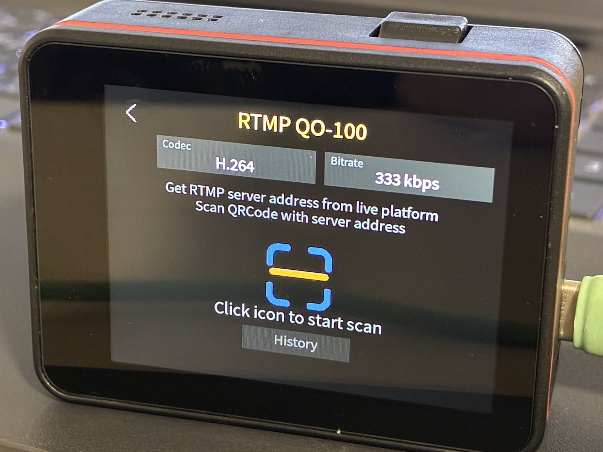
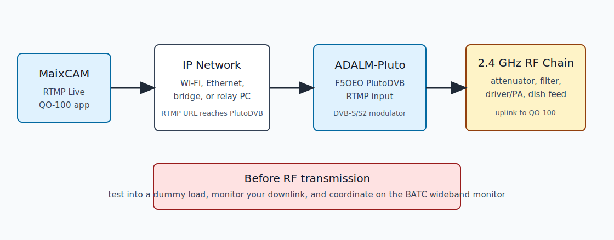
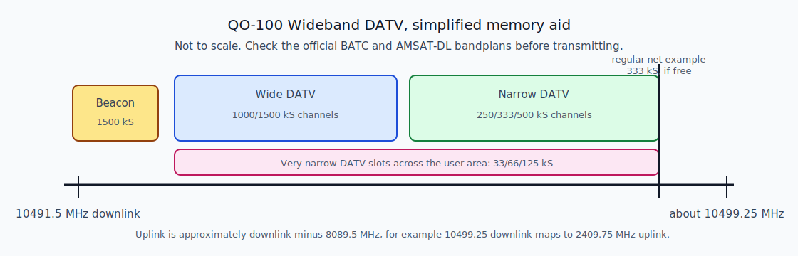

# RTMP Live QO-100 for MaixCAM

**RTMP Live QO-100** is a MaixCAM/MaixCAM2 application for amateur radio DATV operators who want a small camera to send a low-bitrate RTMP video stream toward an ADALM-Pluto based QO-100 station.

It is for beginners and experimenters building a QO-100 wideband DATV setup with MaixPy, RTMP, F5OEO PlutoDVB firmware, Portsdown, or another compatible RTMP-to-DATV chain. It is not a complete transmitter by itself: the MaixCAM provides the encoded video stream, and your Pluto/Portsdown/RF chain performs the DVB-S/S2 modulation and 2.4 GHz uplink.



## What It Does

- Streams live MaixCAM video over RTMP.
- Lets the user choose `H.264` or `H.265`.
- Provides QO-100-style low bitrate presets: `33`, `66`, `125`, `250`, `333`, `500 kbps`, `1`, `1.5`, and `2 Mbps`.
- Defaults to `333 kbps`, a common starting point for narrow DATV experiments.
- Saves the selected codec, selected bitrate, last URL, and URL history after each change.
- Stores the 10 most recent RTMP URLs or scanned QR codes.
- Keeps QR scanning, but also lets the user reopen an older URL from the on-screen `History` button.

## Important Radio Notes

You must be licensed and permitted to transmit on the relevant amateur bands in your country. Test into a dummy load before connecting any amplifier or antenna.

For QO-100 operation, always monitor the wideband transponder and coordination chat before transmitting. The AMSAT-DL/BATC guidance asks users to coordinate and use the transponder efficiently. Start with very low RF power, verify your own downlink, and keep your signal below the recommended power density.

The app bitrate is a **video encoder bitrate in bits per second**. The PlutoDVB URL usually contains a **DVB symbol rate in kS/s**. These are related but not the same number. For example, `333 kbps` video can be a sensible input bitrate for a `333 kS/s` DVB-S2 transmission, but the final fit depends on modulation, FEC, audio, null packets, and receiver margin.

## Typical Station Layout



The MaixCAM must be able to reach the RTMP receiver by IP. If the Pluto is only connected to a PC by USB, its default USB network address is usually visible only from that PC. In that case use one of these approaches:

- Give PlutoDVB network access with a supported USB Ethernet adapter.
- Route or bridge traffic from your LAN/Wi-Fi network to the Pluto USB network.
- Send the MaixCAM RTMP stream to a PC/Raspberry Pi relay and let that machine feed the Pluto.

## QO-100 Wideband Reminder

This simplified bandmap is only a memory aid. Use the official BATC and AMSAT-DL pages for current operating guidance and frequency choices.



BATC lists very narrow DATV channels for `33/66/125 kS`, narrow DATV channels for `250/333/500 kS`, and wide channels around `1000/1500 kS`. BATC also notes that regular nets should use `10499.25 MHz` downlink and `333 kS` when possible, but do not transmit there unless the frequency is free and coordinated.

## Hardware You Need

- MaixCAM or MaixCAM2 running MaixPy.
- Network path from MaixCAM to the RTMP receiver or PlutoDVB.
- ADALM-Pluto SDR.
- F5OEO PlutoDVB firmware on the Pluto, or a Portsdown/compatible DATV system that can consume the stream.
- 2.4 GHz QO-100 uplink RF chain: filtering, driver/PA, dish feed, and suitable attenuators.
- A way to receive and monitor your downlink, for example MiniTiouner/Ryde/Longmynd or the BATC wideband monitor.
- A stable reference for serious operation. A GPSDO or other stable reference for the Pluto is strongly recommended.

## Install The MaixCAM App

1. Make sure SSH is enabled on the camera and note the camera IP address.

2. Clone this project:

   ```sh
   git clone https://github.com/ur8us/app_rtmp_live_qo100.git
   cd app_rtmp_live_qo100
   ```

3. Build the MaixCAM app package:

   ```sh
   ./scripts/package.sh
   ```

   This creates `dist/rtmp_live_qo100.zip`.

4. Deploy it to the camera:

   ```sh
   ./scripts/deploy.sh root@<camera-ip>
   ```

5. On the MaixCAM launcher, start `RTMP Live QO-100`.

## Use The App

1. Tap `Codec` to switch between `H.264` and `H.265`.

2. Tap `Bitrate` until the desired bitrate is shown.

3. Scan a QR code containing the full RTMP URL, or tap `History` and select a previously used URL.

4. Tap `Run` to start streaming.

5. Tap the exit icon to stop streaming.

The selected codec and bitrate are saved immediately. The app remembers them after restart.

## RTMP URL Examples

For a simple PC test with FFmpeg listening on your computer:

```text
rtmp://<computer-ip>:1935/live/maixcam
```

For direct PlutoDVB RTMP input, a combined URL normally has this shape:

```text
rtmp://<pluto-ip>:7272/,<uplink-mhz>,DVBS2,QPSK,<symbol-rate-ks>,<fec>,<gain>/<callsign>,,
```

Example format only:

```text
rtmp://192.168.2.1:7272/,2409.750,DVBS2,QPSK,333,23,-20/YOURCALL,,
```

Do not transmit on the example frequency just because it is shown here. Choose a free channel, monitor the BATC wideband spectrum, and coordinate with other users.

## Local Receive Test Before RF

Before involving the Pluto or any RF hardware, test that the camera can stream to a normal RTMP listener.

1. On a computer with FFmpeg:

   ```sh
   ffmpeg -hide_banner -listen 1 -i rtmp://0.0.0.0:1935/live/maixcam -t 10 -c copy maixcam-test.mkv
   ```

2. In the MaixCAM app, use:

   ```text
   rtmp://<computer-ip>:1935/live/maixcam
   ```

3. Open `maixcam-test.mkv` and confirm that video is present.

Development validation for this app recorded a 10-second RTMP file for every selectable bitrate with both H.264 and H.265. All 18 live-camera cases produced 640x480 video and the expected codec.

## Pluto Firmware

For QO-100 DATV with ADALM-Pluto, install **F5OEO PlutoDVB firmware**. The F5UII PlutoDVB pages are the most beginner-friendly installation notes, and the BATC Portsdown pages describe the firmware versions expected by Portsdown.

Recommended reading order:

1. Read the Analog Devices Pluto firmware upgrade instructions so you know the normal recovery/update process.
2. Update the Pluto to a suitable official Analog Devices firmware if your DATV firmware instructions require it.
3. Install F5OEO PlutoDVB or PlutoDVB Perseverance firmware by copying `pluto.frm` to the Pluto mass-storage drive and ejecting it.
4. Wait several minutes. Do not unplug power during flashing.
5. Open the Pluto web page and confirm that the PlutoDVB controller is available.

BATC notes that F5OEO firmware has an RTMP input mode and a web/UDP input mode. BATC also notes that the Portsdown RTMP path is H.264-only. This app can send H.265 as HEVC-in-FLV, but H.265 RTMP support depends on your PlutoDVB firmware, receiver, and workflow. Start with H.264 for compatibility.

## Beginner QO-100 Setup Steps

1. Build and test the receive side first. You should be able to see the QO-100 wideband beacon or other stations before transmitting.

2. Flash the Pluto with the DATV firmware recommended for your workflow.

3. Make the Pluto reachable from the MaixCAM network.

4. Start with no PA connected. Use a dummy load or heavy attenuation.

5. Create a QR code for your RTMP URL. Include all PlutoDVB parameters in the URL.

6. Start `RTMP Live QO-100`, select `H.264`, select `333 kbps`, scan the QR code, and run the stream.

7. Confirm that PlutoDVB receives the RTMP stream.

8. Only after local tests pass, connect the RF chain at minimum power.

9. Monitor the BATC wideband spectrum and your receiver while slowly increasing power.

10. Save successful URLs in the app history and reuse them from the `History` button.

## Useful References

- MaixPy GitHub: <https://github.com/sipeed/MaixPy>
- MaixPy RTMP API: <https://wiki.sipeed.com/maixpy/api/maix/rtmp.html>
- MaixCAM RTMP streaming example: <https://wiki.sipeed.com/maixpy/doc/zh/video/rtmp_streaming.html>
- F5OEO PlutoDVB firmware source: <https://github.com/F5OEO/datvplutofrm>
- F5UII PlutoDVB QO-100 guide: <https://www.f5uii.net/en/transmit-datv-over-qo100-with-sdr-adalm-pluto-f5oeo-plutodvb/>
- F5UII PlutoDVB Perseverance firmware notes: <https://www.f5uii.net/en/patch-plutodvb/>
- Analog Devices PlutoSDR firmware: <https://github.com/analogdevicesinc/plutosdr-fw>
- BATC Portsdown 4: <https://wiki.batc.org.uk/Portsdown_4>
- BATC Portsdown 4 Pluto notes: <https://wiki.batc.org.uk/Portsdown_4_Pluto>
- BATC QO-100 wideband bandplan: <https://wiki.batc.org.uk/QO-100_WB_Bandplan>
- AMSAT-DL QO-100 wideband guidelines: <https://amsat-dl.org/en/p4-a-wb-transponder-bandplan-and-operating-guidelines/>
- BATC QO-100 wideband monitor: <https://eshail.batc.org.uk/wb/>
- Denis UR8US on QRZ: <https://www.qrz.com/db/UR8US>
- Denis S58UA on QRZ: <https://www.qrz.com/db/S58UA>

## Credits

This project is based on the Sipeed MaixPy RTMP Live example/application and was adapted for QO-100 DATV use by Denis UR8US/S58UA with help from Codex 5.5.

## License

The MaixPy project is Apache 2.0 licensed. This repository includes the upstream MaixPy license file and keeps the same license for the derived application code unless a file states otherwise.
